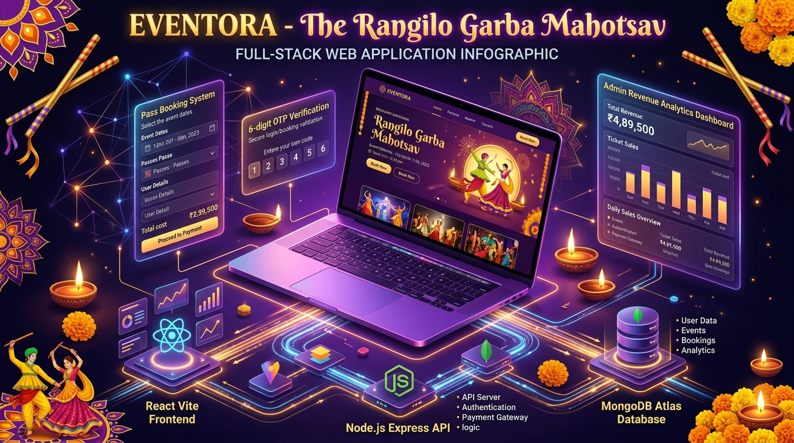

# 🌟 EVENTORA — The Rangilo Garba Mahotsav Platform



A modern full-stack web application for booking Garba & Dandiya Mahotsav event passes, authentic Gujarati food passes, and exploring 9-night festival schedules. Built with **React 19**, **Node.js**, **Express 5**, **MongoDB**, and **Tailwind CSS**.

---

## ✨ Features

- 🎟️ **Pass Booking System:** VIP All-Night Season Passes, Single Night Passes, Couple Passes, and Group Entries.
- 🍲 **Food Pass Management:** Kathiyawadi Unlimited Thalis, Navratri Fasting/Farali meals, and digital food court credits.
- 🔐 **Secure 6-Digit OTP Verification:** Integrated OTP validation via email for both account registration and booking confirmation.
- 👑 **Admin Portal:** Live statistics (Total Revenue, Confirmed Pass Holders, Pending Requests), pass creation/deletion, and booking approval workflow.
- 📱 **Responsive & Festive UI:** Designed with rich Gujarati festive aesthetics, sleek glassmorphism, and responsive Tailwind layouts.

---

## 🛠️ Tech Stack

- **Frontend:** React 19, Vite, Tailwind CSS v4, React Router 7, Axios, React Icons
- **Backend:** Node.js, Express 5, Mongoose 9, JWT, BcryptJS, Nodemailer
- **Database:** MongoDB Atlas

---

## 🚀 Quick Start (Local Development)

### 1. Prerequisites
- Node.js (v18+)
- MongoDB (local or Atlas)

### 2. Installation
Clone the repository and install all dependencies:
```bash
git clone https://github.com/<your-username>/eventora.git
cd eventora
npm run install:all
```

### 3. Environment Setup
Create `.env` inside `server/`:
```env
PORT=5000
MONGODB_URI=your_mongodb_connection_string
JWT_SECRET=your_jwt_secret_key
EMAIL_USER=your_email@gmail.com
EMAIL_PASS=your_gmail_app_password
```

Create `.env` inside `client/`:
```env
VITE_API_URL=http://localhost:5000/api
```

### 4. Seed Dummy Data (Optional)
```bash
npm run seed
```

### 5. Run Concurrently (Client + Server)
```bash
npm run dev
```
- Client running at: `http://localhost:5173`
- Backend API running at: `http://localhost:5000`

---

## 🌐 Free Deployment Guide

- **Frontend:** Deploy on [Vercel](https://vercel.com) (Root: `client`, Build: `npm run build`, Output: `dist`)
- **Backend:** Deploy on [Render](https://render.com) (Root: `server`, Build: `npm install`, Start: `node index.js`)
- **Database:** Free M0 Sandbox cluster on [MongoDB Atlas](https://www.mongodb.com/cloud/atlas)

---

## 📄 License
ISC License.
